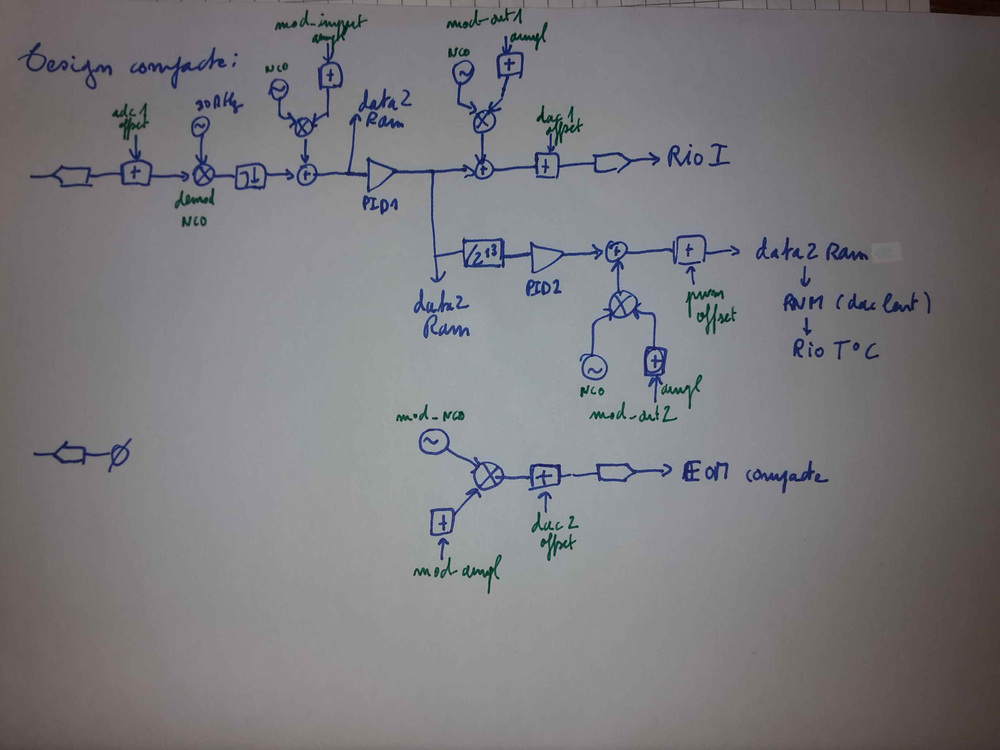

# Design demod_pid1_pidpwm3_vco_only2

## Description

Design used to phase lock the frequency of a diode laser on the resonnant frequency of a compact Fabry-Perot cavity, with a feedback on the diode's current and temperature (slower).

## RF scheme of the design  

