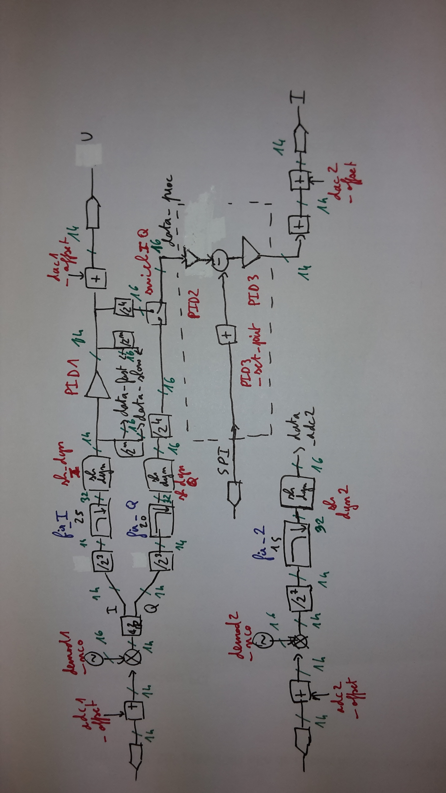

# Design demod_pid_only1_adc_ram_dac2

## Description

Design used to lock the residual amplitude modulation of a stabilized laser. 
PID2, PID3, and PID3_set_point variables are used for a temperature lock loop performed from the CPU.

## RF scheme of the design  

Swich IQ checked: Q branch used.