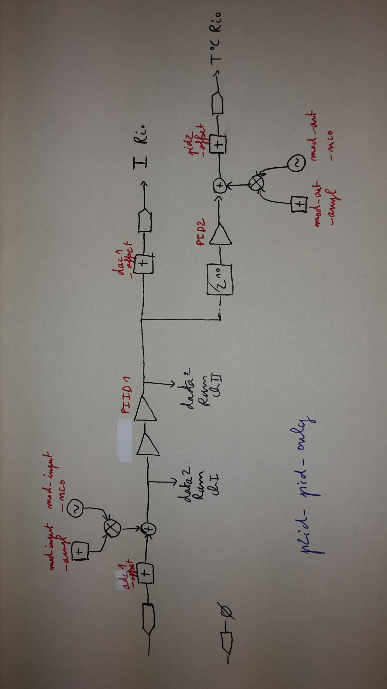

# Design p2id_pid_only

## Description

Design used to phase lock the frequency of a diode laser on the frequency of another stabilized laser, with a feedback on the diode's current and temperature (slower).

## RF scheme of the design  

