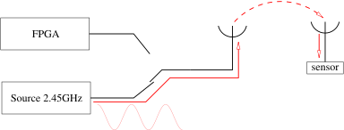
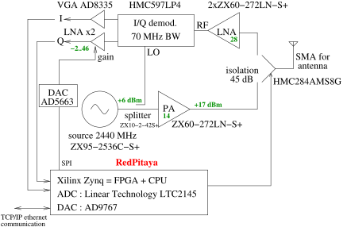
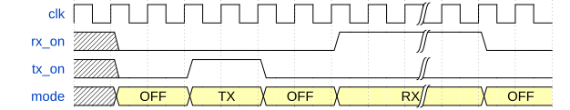
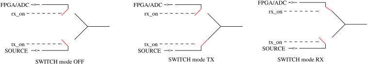
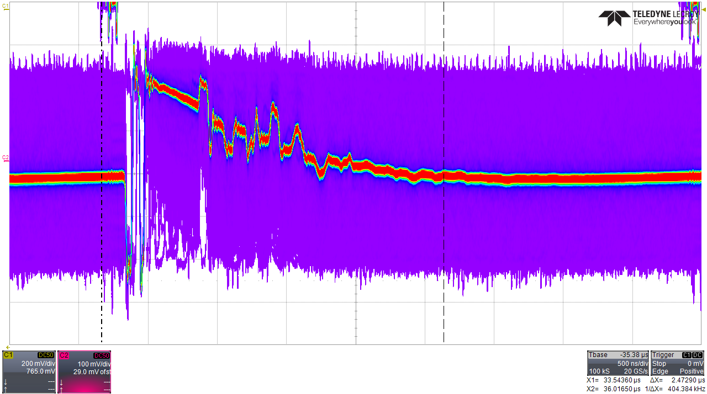
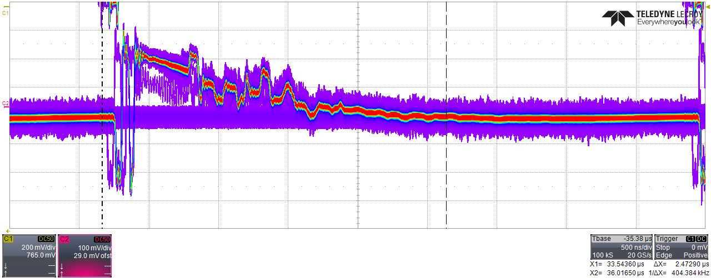
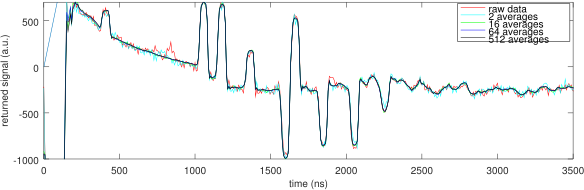
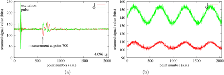
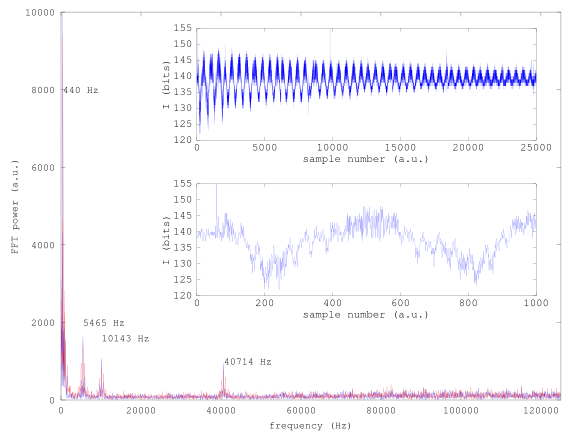

# Pulsed RADAR for SAW sensor interrogation

## Purpose

Surface Acoustic Wave (SAW) transducers act as ideal cooperative targets for
passive wireless sensing.
Many means of probing the RADAR cross section of SAW sensors have been
demonstrated as long as
the emitted signal spectrum matches the sensor transfer function. While pulsed
mode RADAR is hardly energy
efficient, it provides the unique opportuniy of maximizing measurement bandwidth
by collecting a full
sensor response at the pulse repetition rate. Assuming the longest sensor delay
is 4 microseconds, the
measurement refresh rate can reach 250 kHz, a useful characteristics for
vibration monitoring when probing
strain sensors for example.

## Principle

2 phases:

Pulse emission ($1/K^2\simeq 20$ periods=10--20 ns)

Reception of echoes

## Hardware

A VCO (MiniCircuits ZX95-2536C-S+) has been selected as signal source to easily
demonstate the local oscillator stability sensitivity of the measurement.
The VCO feeds a fast radiofrequency switch (Hittite HMC284A) triggered
by the Redpitaya to generate the emitted pulse. A fraction of the VCO power
(MiniCircuits ZX10-2-42-S+ splitted)
drives a I/Q detector (Analog Devices ADL5380 evaluation board) fed on the
other hand by the amplified (2x MiniCircuits
ZX60-272LN-S+) received
signal. The I/Q detector output is amplified by a baseband VGA (Variable
Gain Amplified, Analog Devices AD8335 Evaluation
Board) whose output feeds
the Redpitaya ADC. Since a typical SAW sensor echo lasts a few tens of
nanoseconds, the 125 MS/s (8-ns sampling
period) is more than enough to collect the sensor response. Observing the
fast evolution of the echo phase
is achieved by generating on the fast DAC outputs an analog copy of the I
and Q coefficients best viewed
on a radiofrequency grade oscilloscope.

- half duplex antenna (RF switch for RX/TX)
- redpitaya (dual ADC & DAC 14bits\@125MHz) used for data acquisition,
    drive RF switch, data storage and user communication interface

In this demonstration, the antenna (common port of the switch) is replaced
with a SAW Components (Dresden, Germany) 2.45 GHz sensor connected through
20-dB attenuators.

REMEMBER to load the channels of the oscilloscope connected to the DAC output
to 50 ohm, while the trigger
signal must be loaded on a high impedance (1 Mohm) input.

## FPGA internals

-   duppl (analog splitter equivalent) is used to duplicate flow;
-   switch (multiplexer) used to bypass some blocks or to select between
    full burst or one point by burst
-   everything is runtime configurable, by user, according to the
    environment or sensor.

### GenRadar

2 main roles:
-   drives RF switch through 2 GPIOs;
-   propagates valid data (burst) in RX phase.

off, tx and rx length are user configurable from CPU.

Fix interrogation rate (only limited by sensor echo lengths).

### check_burst

Bluetooth or WiFi digital communication burst corruption of sensor
response

Only valid bursts are propagated

-   start/stop offset are user configurable;
-   accumulates samples and compares standard deviation to threshold:
    -   lower $\Rightarrow$ propagates burst;
    -   greater $\Rightarrow$ discards burst.

### mean\_vector

-   process in FPGA $\Rightarrow$ improves datarate: no burst lost & no
    PL-PS communication time wasted on corrupted datasets
-   power of two (uses shift instead of division)

### extract\_data

Propagates only one sample according to offset provided by user.

## FPGA access from CPU

design memory map

All parameters (pulse duration, pulse repetition rate, averaging, rejecting
noise as defined by excessive signal fluctuations at delays known not to hold
echoes from the sensor) are defined from the userland applocation as described
in the
<a href="app">application</a> directory.

## Result

This setup has been used to collect the results presented in [@RSI2014]

---
references:
- id: RSI2014
  title: Fast contactless vibrating structure characterization using real time FPGA-based digital signal processing: demonstrations with a passive wireless acoustic delay line probe and vision
  author:
  - family: G. Goavec-Merou, N. Chrétien, J.-M Friedt, P. Sandoz, G. Martin, M. Lenczner, S.Ballandras
  container-title: Rev. Sci. Instrum.
  volume: 85
  URL: 'https://aip.scitation.org/doi/10.1063/1.4861190'
  DOI: 10.1063/1.4861190
  issue: 1
  page: 015109-
  type: article-journal
  issued:
    year: 2014
    month: 1
---
