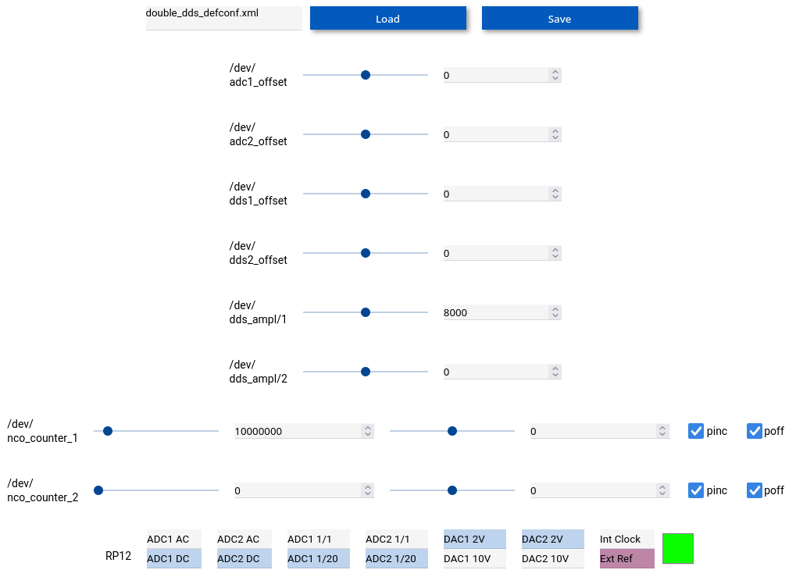

Tested functional with Vivado 2019.1 and 2021.1 but fails with 2022.2 (floating point exception).

Tested functional with Buildroot 2024.11.1 on a Debian/Linux sid (gcc-14.02) --
make sure to include ``python-lxml``, ``python-pyzmq`` and ``python-remi``.

```
cd design
make xpr
make xml
make
cd ..
../../tools/module_generator/module_generator double_dds.xml
../../tools/webserver_generator/webserver_generator.py double_dds.xml
cd app
make
```

On the Red Pitaya SIGNALlab 250-12:
```
./double_dds_us.sh  # might require tuning CORE_MODULES_DIR and the location of the bitstream
lsmod  # check .ko were loaded
dmesg  # check the bitstream was loaded and .ko configurations
./double_dds_webserver.py
```

REMI web server:



Experimental setup:


