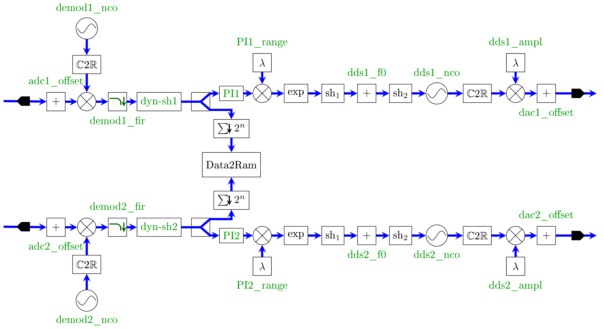
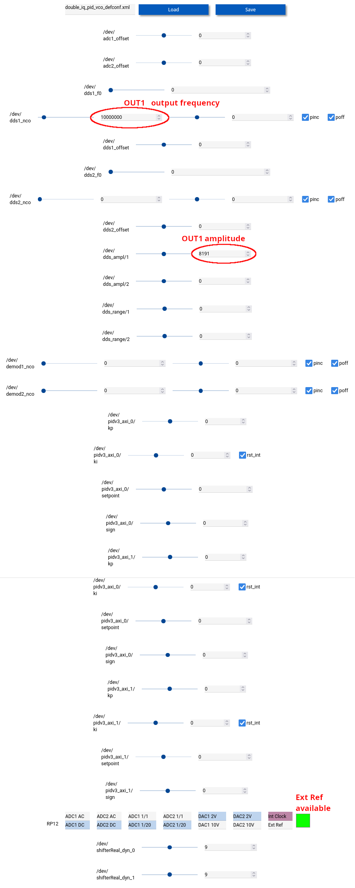
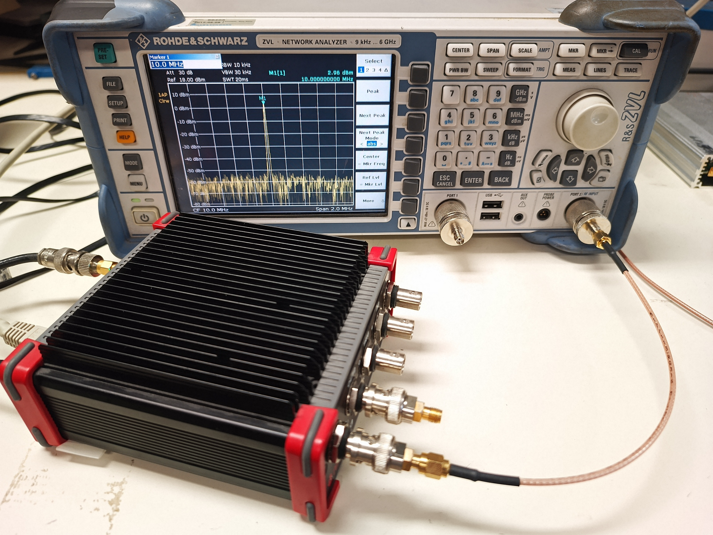

# Design double_iq_pid_vco

```
cd design
make xpr
make xml
make
cd ..
../../tools/module_generator/module_generator double_iq_pid_vco.xml
../../tools/webserver_generator/webserver_generator.py double_iq_pid_vco.xml
```

## Description

Double lock loop with modulation and demodulation. Used for a PLL in an optical fiber link.

## RF scheme of the design  



## Web server setup

Notice (red highlight) the output frequency, amplitude and the availability of the external reference 
clock (green square).



## Experimental setup


